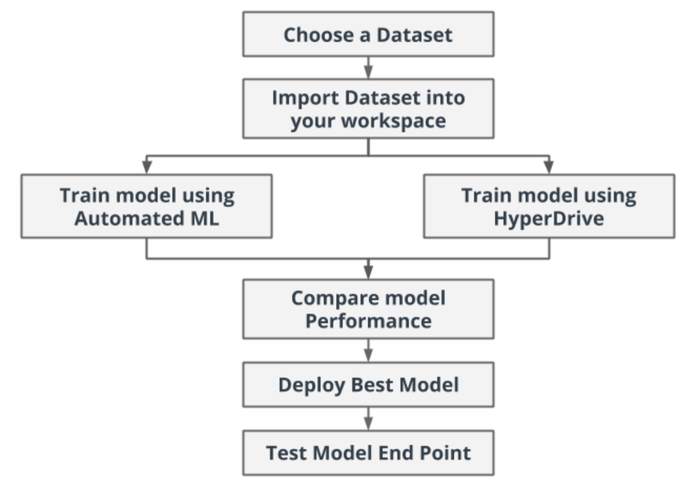
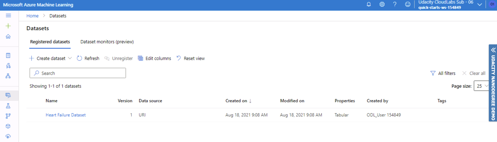
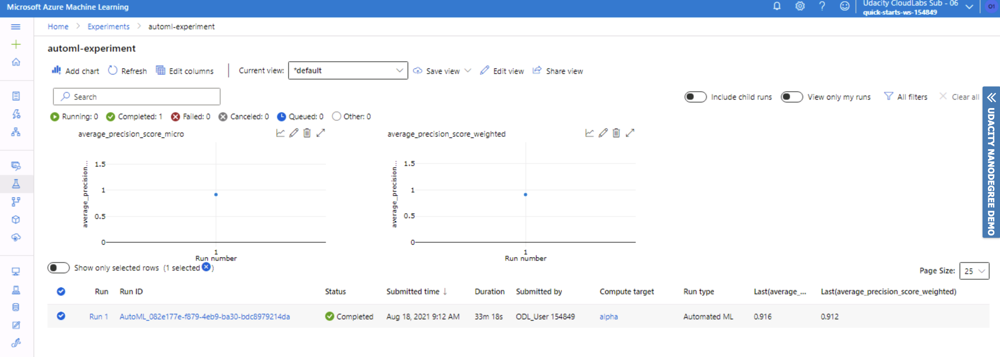
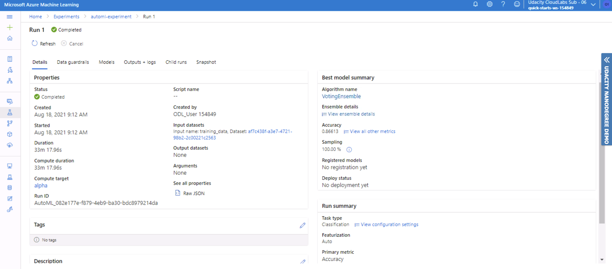
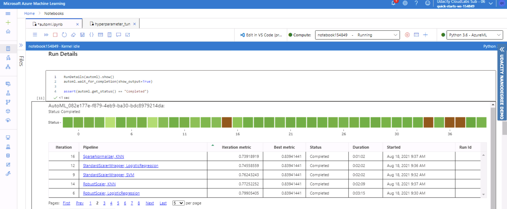
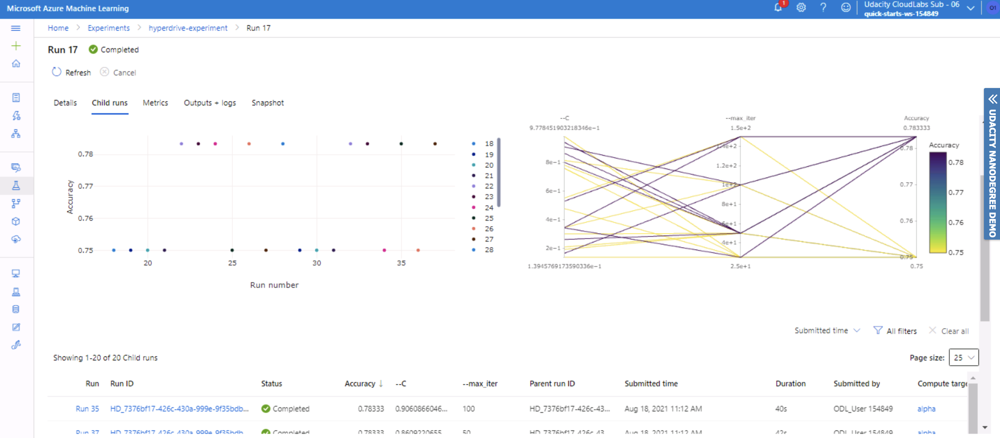

# Capstone Project ML Engineer with Azure

## Project Overview
This project is part of the Udacity Azure ML Nanodegree. The aim of the project is to solve an interesting problem using Azure Machine Learning.\
Two models will be created: one using *Automated ML* (denoted as *AutoML*) and one customized model whose hyperparameters are tuned using *HyperDrive*. Then, the performance of both the models will be compared and the best performing model will be deployed and consumed through *Azure Container Instance* and *REST endpoint* respectively.

The following diagram shows all the steps of the entire process:



## Project Set Up and Installation
The project contains the following files:
- `hyperparameter_tuning.ipynb`: jupyter notebook used to perform *HyperDrive*
- `automl.ipynb`: jupyter notebook used to perform *AutoML*
- `train.py`: python script used for hyperparameters tuning, containing logistic regression model
- `endpoint.py`: python script used to interact with the deployed model
- `img`: folder containing all the screenshots produced during the experiments
- `data`: folder containing `heart_failure_clinical_records_dataset.csv`, the dataset used in the project

To run the project:
1. Run the `hyperparameter_tuning.ipynb` notebook to find the best model with *HyperDrive*
2. Run the `automl.ipynb` notebook to find the best model with *AutoML*
3. Compare the two model accuracy, and choose the best performing one
4. Deploy the best model identified at the above step, running the cells of the best model notebook

## Table of Contents
- [Project Overview](#project-overview)
- [Project Set Up and Installation](#project-set-up-and-installation)
- [Dataset](#dataset)
  - [Overview](#overview)
  - [Task](#task)
  - [Access](#access)
- [Automated ML](#automated-ml)
  - [Results](#results)
- [Hyperparameter Tuning](#hyperparameter-tuning)
  - [Results](#results)
- [Model Deployment](#model-deployment)
- [Screen Recording](#screen-recording)
- [Future Work](#future-work)

## Dataset
In this project, a [heart failure dataset](https://www.kaggle.com/andrewmvd/heart-failure-clinical-data) from kaggle is used.\
The dataset has been stored [here](./data/heart_failure_clinical_records_dataset.csv) and is used for predicting mortality caused by heart failure.

### Overview
Cardiovascular diseases (CVDs) are the number 1 cause of death globally, taking an estimated 17.9 million lives each year, which accounts for 31% of all deaths worlwide.
Heart failure is a common event caused by CVDs and this dataset contains 12 features that can be used to predict mortality by heart failure.\
Most cardiovascular diseases can be prevented by addressing behavioural risk factors such as tobacco use, unhealthy diet and obesity, physical inactivity and harmful use of alcohol using population-wide strategies.\
People with cardiovascular disease or who are at high cardiovascular risk (due to the presence of one or more risk factors such as hypertension, diabetes, hyperlipidaemia or already established disease) need early detection and management wherein a machine learning model can be of great help.

### Task
The dataset contains 299 observations and 13 columns (12 features + 1 target):

| Features |  Description |
|---|---|
| age | age (years) |
| anaemia  | Decrease of red blood cells or hemoglobin (boolean) |
| creatinine_phosphokinase  | Level of the CPK enzyme in the blood (mcg/L) |
| diabetes  | If the patient has diabetes (boolean)  |
| ejection_fraction  | Percentage of blood leaving the heart at each contraction (percentage) |
| high_blood_pressure  | If the patient has hypertension (boolean) |
| platelets  | Platelets in the blood (kiloplatelets/mL) |
| serum_creatinine  | Level of serum creatinine in the blood (mg/dL) |
| serum_sodium  | Level of serum sodium in the blood (mEq/L) |
| sex  | Woman or man (binary) |
| smoking  | If the patient smokes or not (boolean) |
| time  | Follow-up period (days) |

| Target | Description |
|---|---|
| DEATH_EVENT | If the patient deceased during the follow-up period (boolean) |

The task is addressed as a classification task and the goal is to predict if a patient deceases during the follow-up period, using the features listed above.\
The target, DEATH_EVENT variable, has two possible values: 0 or 1.

### Access
The dataset has been loaded as `TabularDataset` and registered in workspace using SDK:
```python
found = False
key = "Heart Failure Dataset"
description_text = "Heart Failure Dataset for Udacity Project 3"

if key in ws.datasets.keys():
        found = True
        dataset = ws.datasets[key]

if not found:
        # Create AML Dataset and register it into Workspace
        example_data = 'https://github.com/peppegili/3_Capstone_Project_ML_Engineer/blob/master/data/heart_failure_clinical_records_dataset.csv'
        dataset = Dataset.Tabular.from_delimited_files(example_data)        
        #Register Dataset in Workspace
        dataset = dataset.register(workspace=ws,
                                   name=key,
                                   description=description_text)

df = dataset.to_pandas_dataframe()
```



## Automated ML
In this task, an `AutoML` pipeline is built.
Automated machine learning, also referred to as automated ML or AutoML, is the process of automating the time-consuming, iterative tasks of machine learning model development. It allows to build ML models with high scale, efficiency, and productivity all while sustaining model quality.

`AutoMLConfig` class is responsable of the automated machine learning process. It contains the parameters for configuring the experiment run:

```python
# AutoML config
automl_settings = {
    "experiment_timeout_minutes": 20,
    "max_concurrent_iterations": 5,
    "n_cross_validations": 4,
    "primary_metric" : 'accuracy'
}

automl_config = AutoMLConfig(compute_target=compute_cluster,
                             task="classification",
                             training_data=dataset,
                             label_column_name="DEATH_EVENT",   
                             path=project_folder,
                             enable_early_stopping=True,
                             featurization='auto',
                             debug_log="automl_errors.log",
                             **automl_settings
                            )
```

The main configuration parameters are explained below:
- `experiment_timeout_minutes`: maximum amount of time in minutes that all iterations combined can take before the experiment terminates. It has been set to *20*
- `max_concurrent_iterations`: maximum number of iterations that would be executed in parallel. It has been set to *5*
- `n_cross_validations`: how many cross validations to perform when user validation data is not specified. It has been set to *4*
- `primary_metric`: the metric that Automated Machine Learning will optimize for model selection. It has been set to *accuracy*

### Results
Once the AutoML run has been submitted to the experiment, the best run and the related metrics have been collected:
```python
best_run_automl, best_model_automl = automl.get_output()
best_run_metrics_automl = best_run_automl.get_metrics()

print('Best run ID: ', best_run_automl.id)
print('Best run Accuracy: ', best_run_metrics_automl['Accuracy'])
print('Metrics: ', best_run_metrics_automl)
```
```
Best run ID: AutoML_082e177e-f879-4eb9-ba30-bdc8979214da_38
Best run Accuracy: 0.866126126126126
Metrics:  {'matthews_correlation': 0.6871372145654745, 'norm_macro_recall': 0.6531370759654658, 'average_precision_score_macro': 0.8827546675215476, 'recall_score_micro': 0.866126126126126, 'f1_score_micro': 0.866126126126126, 'AUC_weighted': 0.9111851379683301, 'precision_score_macro': 0.8620010449320794, 'recall_score_weighted': 0.866126126126126, 'AUC_micro': 0.9141805372940508, 'precision_score_weighted': 0.8718187513532341, 'accuracy': 0.866126126126126, 'f1_score_macro': 0.8354493907625058, 'precision_score_micro': 0.866126126126126, 'weighted_accuracy': 0.8929963269988462, 'recall_score_macro': 0.8265685379827329, 'f1_score_weighted': 0.8610660544772686, 'AUC_macro': 0.91118513796833, 'log_loss': 0.4219576391808034, 'balanced_accuracy': 0.8265685379827329, 'average_precision_score_micro': 0.9156178252623035, 'average_precision_score_weighted': 0.9123732365805568, 'accuracy_table': 'aml://artifactId/ExperimentRun/dcid.AutoML_082e177e-f879-4eb9-ba30-bdc8979214da_38/accuracy_table', 'confusion_matrix': 'aml://artifactId/ExperimentRun/dcid.AutoML_082e177e-f879-4eb9-ba30-bdc8979214da_38/confusion_matrix'}
```

The pipeline has been completed in 33m 18s.



#### Best Model


The best model was **VotingEnsemble** with:
- ***Parameters***
  - `reg_alpha` = 2.3958333333333335
  - `reg_lambda` = 1.5625
  - `subsample` = 0.5
  - ...

  The complete information has been reported below:
  ```
  Pipeline(memory=None,
         steps=[('datatransformer',
                 DataTransformer(enable_dnn=False, enable_feature_sweeping=True, feature_sweeping_config={}, feature_sweeping_timeout=86400, featurization_config=None,                              force_text_dnn=False, is_cross_validation=True, is_onnx_compatible=False, observer=None, task='classification',                                                                    working_dir='/mnt/batch/tasks/shared/LS_root/mount...
                 ), random_state=0, reg_alpha=2.3958333333333335, reg_lambda=1.5625, subsample=0.5, tree_method='auto'))], verbose=False))], flatten_transform=None, weights=                        [0.09090909090909091,   0.18181818181818182, 0.09090909090909091, 0.09090909090909091, 0.09090909090909091, 0.09090909090909091, 0.09090909090909091,                               0.09090909090909091, 0.09090909090909091, 0.09090909090909091]))],
         verbose=False)
  ```

- ***Accuracy***: 0.866126126126126

The experiment run with `RunDetails` has been reported below:



All the others screenshots of the experiment have been store [here](./img).

*TODO* add how could you have improved it?

## Hyperparameter Tuning
In this task, an `HyperDrive` pipeline using a customized model is built.\
The model chosen was scikit-learn `logistic regression` model.\
Logistic regression is a classification algorithm used in binary classification problems, when the dependent variable (DEATH_EVENT) is categorical. It uses the logistic function to model the probability of a certain class or event (1 or 0).\
For this reason, this model is suitable for our task.

The `train.py` script has been used to train the model, using two hyperparameters tuned with HyperDrive:
- `C`: inverse of regularization strength. Smaller values cause stronger regularization
- `max_iter`: maximum number of iterations for model to converge

Hyperparameter tuning can be computationally expensive, so HyperDrive helps to automate and speeds up hyperparameter tuning process, choosing these parameters. `HyperDriveConfig` class is responsible of the hyperparameters tuning process. It includes information about hyperparameter space sampling, termination policy, primary metric and estimator.

Specify hyperparameter space sampling and termination policy is very important:
- `hyperparameter_sampling`: defines the hyperparameters sampling space. `RandomParameterSampling` randomly select hyperparameters values over the search space. It is not computationally expensive and it is not exhaustive but it works well in most cases.\
`C` and `max_iter` parameters have been passed to the sampler:
```python
# Specify parameter sampler
param_sampling = RandomParameterSampling(
    {
        "--C": uniform(0.1, 1.0),
        "--max_iter": choice(25, 50, 100, 150)
    }
)
```
- `policy`: defines the early termination policy to use. `BanditPolicy` is based on slack criteria, and a frequency and delay interval for evaluation. Any run that doesn't fall within the slack factor or slack amount of the evaluation metric with respect to the best performing run will be terminated. It automatically terminates poorly performing runs, saving time and improving computational efficiency:
```python
# Specify a Policy
early_termination_policy = BanditPolicy(evaluation_interval=2, slack_factor=0.1)
```

### Results
Once the HyperDrive run has been submitted to the experiment, the best run and the related metrics have been collected:
```python
best_run_hdr = hdr.get_best_run_by_primary_metric()
best_run_metrics_hdr = best_run_hdr.get_metrics()
best_params_hdr = best_run_hdr.get_details()['runDefinition']['arguments']

print('Best run ID: ', best_run_hdr.id)
print('Best run Accuracy: ', best_run_metrics_hdr['Accuracy'])
print('Metrics: ', best_run_metrics_hdr)
```
```python
Best run ID: HD_7376bf17-426c-430a-999e-9f35bdb293c8_5
Best run Accuracy: 0.7833333333333333
Metrics:  {'Regularization Strength:': 0.3438062646130631, 'Max iterations:': 25, 'Accuracy': 0.7833333333333333}
```

The pipeline has been completed in 09m 37s.



#### Best Model
- ***Parameters***
  - `C` = 0.3438062646130631
  - `max_iter` = 25
- ***Accuracy***: 0.7833333333333333

*TODO* Remeber to provide screenshots of the `RunDetails` widget as well as a screenshot of the best model trained with it's parameters.

Some screenshots of the experiment have been store [here](./img).

*TODO* add how could you have improved it?

## Model Deployment
Comparing the performances (accuracy) of the two approaches, we have obtained:
- `AutoML`: 0.87
- `HyperDrive`: 0.78

AutoML model performs better than HyperDrive one.\
For this reason the AutoML best model has been deployed to *Azure Container Instance*

## Screen Recording
[Link]() to the video

## Future Work
- Try to run HyperDrive with a more exhaustive parameter sampler for hyperparameters tuning, i.e. grid sampling, or try to increase the search space
- Try to validate more metrics, i.e. AUC
- Try to use different customized models, i.e. neural network (non trivial choice with a small dataset)
- Try to work more in depth in feature engineering process, creating and investigating new predictive features
- Show model output using an user friendly dashboard
